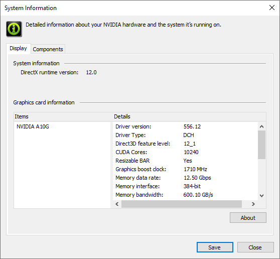
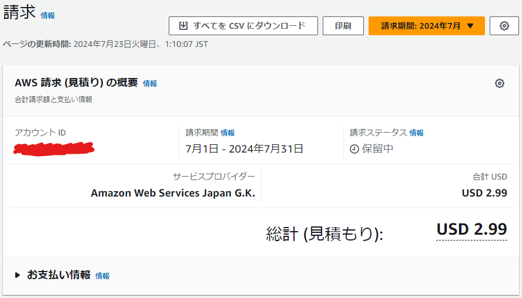
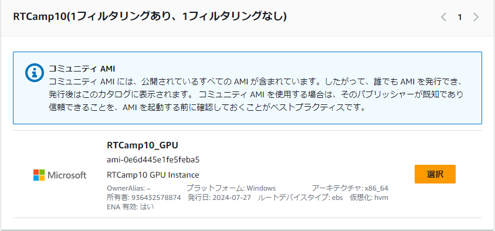
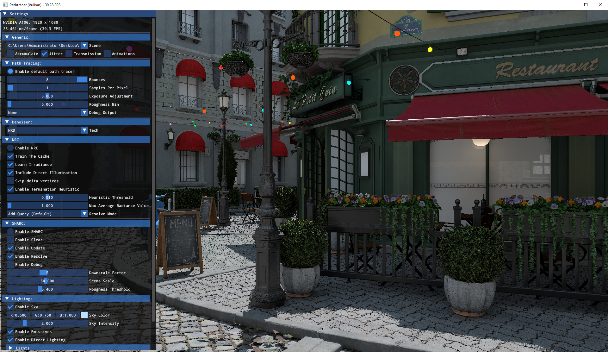

# レイトレ合宿 AWS EC2/S3 101

<!-- TOC depthfrom:2 -->

- [用語](#%E7%94%A8%E8%AA%9E)
- [EC2の課金について](#ec2%E3%81%AE%E8%AA%B2%E9%87%91%E3%81%AB%E3%81%A4%E3%81%84%E3%81%A6)
- [EC2でインスタンスを実際に作ってみる](#ec2%E3%81%A7%E3%82%A4%E3%83%B3%E3%82%B9%E3%82%BF%E3%83%B3%E3%82%B9%E3%82%92%E5%AE%9F%E9%9A%9B%E3%81%AB%E4%BD%9C%E3%81%A3%E3%81%A6%E3%81%BF%E3%82%8B)
    - [一から作る手順](#%E4%B8%80%E3%81%8B%E3%82%89%E4%BD%9C%E3%82%8B%E6%89%8B%E9%A0%86)
        - [GPUインスタンスg5下準備](#gpu%E3%82%A4%E3%83%B3%E3%82%B9%E3%82%BF%E3%83%B3%E3%82%B9g5%E4%B8%8B%E6%BA%96%E5%82%99)
        - [インスタンスの作成と接続](#%E3%82%A4%E3%83%B3%E3%82%B9%E3%82%BF%E3%83%B3%E3%82%B9%E3%81%AE%E4%BD%9C%E6%88%90%E3%81%A8%E6%8E%A5%E7%B6%9A)
        - [NVIDIAドライバーなどのインストール](#nvidia%E3%83%89%E3%83%A9%E3%82%A4%E3%83%90%E3%83%BC%E3%81%AA%E3%81%A9%E3%81%AE%E3%82%A4%E3%83%B3%E3%82%B9%E3%83%88%E3%83%BC%E3%83%AB)
        - [インスタンスの終了](#%E3%82%A4%E3%83%B3%E3%82%B9%E3%82%BF%E3%83%B3%E3%82%B9%E3%81%AE%E7%B5%82%E4%BA%86)
    - [レイトレ合宿AMIからGPUインスタンスを作る手順](#%E3%83%AC%E3%82%A4%E3%83%88%E3%83%AC%E5%90%88%E5%AE%BFami%E3%81%8B%E3%82%89gpu%E3%82%A4%E3%83%B3%E3%82%B9%E3%82%BF%E3%83%B3%E3%82%B9%E3%82%92%E4%BD%9C%E3%82%8B%E6%89%8B%E9%A0%86)
- [S3の課金について](#s3%E3%81%AE%E8%AA%B2%E9%87%91%E3%81%AB%E3%81%A4%E3%81%84%E3%81%A6)
- [S3の使用方法](#s3%E3%81%AE%E4%BD%BF%E7%94%A8%E6%96%B9%E6%B3%95)
    - [EC2インスタンスからのアクセス方法](#ec2%E3%82%A4%E3%83%B3%E3%82%B9%E3%82%BF%E3%83%B3%E3%82%B9%E3%81%8B%E3%82%89%E3%81%AE%E3%82%A2%E3%82%AF%E3%82%BB%E3%82%B9%E6%96%B9%E6%B3%95)
- [その他](#%E3%81%9D%E3%81%AE%E4%BB%96)
- [参考](#%E5%8F%82%E8%80%83)

<!-- /TOC -->

各種情報確認日時：2024/07/22

## 用語

AWS: Amazon Web Services
- 今回使用するEC2などを含むAmazonのクラウドサービスの総称です。

EC2: Elastic Computing Cloud
- AWSの代表的なサービスのひとつでクラウド上に様々なOS、ハードウェアを組み合わせて仮想マシンを起動することができます。
  起動される仮想マシンを「インスタンス」と呼びます。
- 「インスタンスタイプ」によってハードウェア構成が決まります。
- 「リージョン」(米国東部や東京といった場所)を指定してインスタンスを起動します。

EBS: Elastic Block Store
- EC2のインスタンスが使用するストレージを提供するサービスです。
- EC2のインスタンスとはネットワークで接続されるようです(それなりには高速)。

インスタンスストア:
- EBSとは異なりインスタンスを実行している物理マシン内蔵のディスクのようです。
- インスタンスタイプによってあったりなかったり。
- レイトレ合宿では多分意識しません。

S3: Simple Storage Service
- クラウドストレージサービス、EC2など様々な手段で接続できます。
- レイトレ合宿参加者でちょっとEC2試す程度なら使う必要はないです。
- EC2と同様リージョンを指定するので同一リージョンであればEC2インスタンスに対して高速にファイルが転送できます。

AMI: Amazon Machine Image
- OSの設定やアプリケーションのインストール情報などを記録、同じ状態のインスタンスを簡単に作れるようにするテンプレートのようなもの。


## EC2の課金について
インスタンス参考課金額 (東京, Windows)
| インスタンスタイプ | 料金<br/>USD/h/inst | CPU | System Mem | GPU | GPU Mem | ストレージ | インスタンスストア | 備考 |
| - | - | - | - | - | - | - | - | - |
| [t2.micro](https://aws.amazon.com/jp/ec2/instance-types/t2/) | 0.0198 | 1 vCPU | 1 GiB | N/A | N/A | EBS | N/A | EC2おためしに最適 |
| [g5.xlarge](https://aws.amazon.com/jp/ec2/instance-types/g5/) | 1.643 | AMD EPYC 7R32<br>4 vCPU | 16 GiB | [NVIDIA A10G](https://www.nvidia.com/ja-jp/data-center/products/a10-gpu/) | 24 GiB | EBS | 250 GiB NVMe SSD | レイトレ合宿10<br>GPUインスタンス |
| [c7i.metal-48xl](https://aws.amazon.com/jp/ec2/instance-types/c7i/) | 19.6176 | Intel Xeon Scalable<br/>[Sapphire Rapids](https://www.intel.co.jp/content/www/jp/ja/products/docs/processors/xeon-accelerated/4th-gen-xeon-scalable-processors.html)<br>192 vCPU | 384 GiB | N/A | N/A | EBS | N/A | レイトレ合宿10<br>CPUインスタンス |

- 起動したインスタンスのタイプ、リージョン、OS等によって単価が変わり、起動時間に応じて課金されます。
  - 単価は一時間単位で示されていますが、課金は秒単位で行われます。
- 起動したインスタンスを「停止」すると課金の大部分はストップしますが、EBSの課金は続きます。課金を完全にストップするにはインスタンスを「終了」する必要があります。
  - 例: 汎用 SSD (gp2) ボリューム: 0.12 USD/GB/month (課金自体は秒単位)
- インスタンスの停止であれば再開時にデータは残っていますが、終了の場合インスタンスを立て直した際にはデータはまっさらになっています。インスタンスストアはリブート以外ではデータが消えるようです。
- インスタンス停止時にEBS以外で課金される追加オプション(IP固定など)はありますが、デフォルトであればおそらくEBSのみです。
- AWSサービスの使用においては常に自分が今どのリージョンの情報を見ているのか注意しましょう。例えば米国インスタンスを立ててもWebページ表示が東京リージョンになっていると起動中のインスタンスがぱっと見無いように見えるかもしれません。
- いっときのマイニングブームの際など、不正ログインされてインスタンスを大量に起動されたという被害も聞くので二要素認証などセキュリティは万全にしておきましょう。
- 事前設定した課金額で全サービスストップなどの機能は無いようですが、一定額で通知する設定は行うことができます。


## EC2でインスタンスを実際に作ってみる

注意：何やら(人によっては？)不正利用防止のためかデフォルトだとg5などのインスタンスを起動できないようです。緩和申請を出す必要があるようです。

### 一から作る手順

※面倒なGPUインスタンスに関しては手順を簡略化できるようにAMIを作りました。後述の「レイトレ合宿AMIからGPUインスタンスを作る手順」も参照。具体的には下記の下準備とドライバーなどのインストールの手順が不要になります。

#### GPUインスタンス(g5)下準備

g5インスタンスでは特殊なNVIDIAドライバーのインストールを必要とする。その際にAWS S3へのアクセスを必要とするため「IAMロール」の作成が必要となる。ちなみにIAMとはIdentity and Access Managementの略。

1. AWSマネジメントコンソールにログイン。
1. サービス > セキュリティ、ID、およびコンプライアンス > IAM
1. アクセス管理 > ロール
1. ロールを作成をクリック。
1. 「AWSのサービス」が選択されていることを確認。\
   ユースケースは「EC2」を選択して「次へ」をクリック。
1. 許可ポリシーとして「AmazonS3ReadOnlyAccess」を選択して「次へ」をクリック。
1. ロール名としてなんでも良いが"S3_ReadAccess"などに設定して「ロールを作成」をクリック。

#### インスタンスの作成と接続

1. AWSマネジメントコンソールにログイン。
   画面上部からリージョンが東京になっていることを確認する。
   (米国インスタンスのほうが少し安いがファイル転送などで時間がかかるので大して変わらない or むしろ高くなる可能性)
1. サービス > コンピューティング > EC2
1. EC2ダッシュボードが表示されるので、「インスタンスを起動」をクリック。
1. 各項目を選んでインスタンス構成を決める。
   1. 名前とタグ\
      あってもなくても良い。
   1. アプリケーションおよびOSイメージ\
      クイックスタートから「Windows」を選択、「Microsoft Windows Server 2022 Base」を選択(されていることを確認)。
   1. インスタンスタイプ\
      GPUインスタンスであれば「g5.xlarge」を選択。(インスタンス名紛らわしいので高いのを選ばないよう注意)\
      CPUインスタンスであれば「c7i.metal-48xl」だが、高価なので試すだけなら小さめのインスタンスで良い。
   1. キーペア\
      作成済みであれば該当のものを選択。未作成であれば「新しいキーペアの作成」をクリック。
   1. ネットワーク設定\
      作成済みであれば該当のものを選択。未作成であれば「セキュリティグループを作成する」にチェックを入れて、許可するRDPトラフィックとして「自分のIP」を選択。
   1. ストレージを設定\
      デフォルトの30GiBで足りない場合は値を変更する。(課金額もそんなに高くないですが上がります)\
      CUDAもインストールする場合は30GiBだと足りません。50-60GiBにすれば余裕があります。
      ボリュームのタイプはデフォルトのgp2。
   1. 高度な詳細\
      GPUインスタンスの場合は「IAMインスタンスプロフィール」として作成済みのIAMロールを選択。\
      CPUインスタンスの場合は「ユーザーデータ」に当リポジトリ内の `scripts/userdata.yml` の内容をコピー。
   1. 右の概要欄を確認して「インスタンスを起動」をクリック。\
      インスタンス数はとりあえず1で試すのが良い。
1. 「インスタンスを起動中」のようなメッセージが表示される。\
   「すべてのインスタンスを表示」をクリック。
1. 起動中のインスタンス一覧が表示される。
   接続したいインスタンスを選んで「接続」をクリック。
1. 「RDPクライアント」タブを選ぶ。
   「リモートデスクトップファイルのダウンロード」をクリックしてrdpファイルを手に入れる。\
   「パスワードを取得」をクリック(インスタンス起動直後はもう少し待てという旨のエラーが出る)、上記で指定したキーペアを選択してアップロード、「パスワードを復号化」をクリック。\
   ログインパスワードが表示されるのでコピー。
1. ダウンロードしたrdpファイルをダブルクリックしてリモートデスクトップ起動、接続、パスワード入力。\
   (ちなみにrdpファイル右クリックから編集に入ると解像度指定などができる。)

- `userdata.xml` (や下記のNVIDIAドライバー個別インストール用の `semiauto_set_up.ps1`)ではpythonのインストール、パスの設定を行っていますが、何やらたまに"python"とPowershellで打ってもコマンドが認識されないことがあるみたいです。その場合は再起動してみてください。

#### NVIDIAドライバーなどのインストール

1. 当リポジトリ内の `scripts/semiauto_set_up.ps1` をデスクトップに転送する。
1. CUDAツールキットの内容に依存しない場合は引数なしでPowerShellから次のように、\
   `C:\Users\Administrator\Desktop> .\semiauto_set_up.ps1`\
   依存する場合はCUDA 12.5のインストーラーを転送して次のように\
   `C:\Users\Administrator\Desktop> .\semiauto_set_up.ps1 path_to_cuda_installler`\
   スクリプトを実行。しばらく待つ。CUDA無しだと6分半くらいかかった。(よくある罠としてPowerShellなどでテキスト選択状態になってしまうとログが進まないので注意。)

- 2024/07/20時点では以下の画像に示すドライバーがインストールされました。\
  

#### インスタンスの終了

1. インスタンス一覧から該当のインスタンスを選んで\
   インスタンスの状態 > インスタンスを終了
   をクリック。

- 終了したインスタンス(「終了済み」ステータス)はおそらく1時間ほどは一覧に残る模様。
- EBSの課金額はそこまで大したことはないのですぐにまた同じインスタンス構成で使う予定がある場合は終了の代わりに停止しておくと手軽。ただし実際に使用されている量ではなく最初に設定したサイズで課金される点には注意。\
  gp2ボリュームであれば 0.12 USD/GB/month なので100GBで一日放置すると 0.4 USD。
- 課金の確認(1-2日程度ラグがあります)はAWSマネジメントコンソールの自分の名前が表示されているところをクリック、「Billing and Cost Management」 > 「請求書」から行えます。\
  

### レイトレ合宿AMIからGPUインスタンスを作る手順

基本は上記の一から作る手順と同じ。差異は以下。

- アプリケーションおよびOSイメージ\
  「その他のAMIを閲覧する」をクリック、検索欄に"RTCamp10"と入力して検索すると「コミュニティAMI」のタブ内に"RTCamp10_GPU"というAMIが見つかるはず。これを選択。
  
- 高度な詳細\
  NVIDIAドライバーはインストール済みなのでS3アクセス用のIAMロールの設定は不要。\
  今回はGPUインスタンスも「ユーザーデータ」に当リポジトリ内の `scripts/userdata.yml` の内容をコピー。


## S3の課金について
[Amazon S3 の料金](https://aws.amazon.com/jp/s3/pricing/)\
レイトレ合宿的に関係ありそうなところだけ。

東京, S3標準

ストレージ使用量に対する課金
- 最初の50TiB: 0.025 USD/GB/month

リクエストに対する課金
- PUT/COPY/POST/LIST, 1000リクエストあたり: 0.0047 USD
- GET/SELECT/others, 1000リクエストあたり: 0.00037 USD

データ転送に対する課金
- 同一リージョン内のEC2インスタンスとの間の転送: 無料


## S3の使用方法
1. AWSマネジメントコンソールにログイン。
   画面上部からリージョンが東京になっていることを確認する。
1. サービス > ストレージ > S3
1. 「バケットを作成」をクリック。
1. 各項目を選んでS3の設定を行う。
   1. バケット名を入力。
   1. 「パブリックアクセスをすべてブロック」にチェックが入っていることを確認する。
   1. その他の設定はデフォルトのまま。\
      バケットのバージョニングも必要なければ無効に。(有効にするとバージョニングされる一方、各バージョンごとのファイルサイズで課金される)
   1. 「バケットを作成」をクリック。
1. バケットの一覧が表示されるので作成したバケットの名前をクリックしてバケットに入る。
1. 「アップロード」をクリックしてアップロード画面に入り、ファイルをアップロードする。

### EC2インスタンスからのアクセス方法
ファイルのダウンロードは
```
Copy-S3Object -BucketName <bucket name> -Key <file path in bucket> -LocalFile <local file path>
```
で行える。
フォルダーをまるごとダウンロードするコマンドは無いため次のようなコードを使う。
```
$objects = Get-S3Object -BucketName <bucket name> -KeyPrefix <directory path>
foreach ($obj in $objects) {
    $dstPath = $obj.Key -replace "^<directory path>", <local directory path>
    Copy-S3Object -BucketName <bucket name> -Key $obj.Key -LocalFile $dstPath
}
```
個別のファイルごとにアクセスが必要ないのであれば、zip等で単一ファイルでアップロード・ダウンロードするほうがファイルサイズやリクエスト数が減るので簡単・低コスト。


## その他

- 実行ファイルが何に依存しているかは [Dependencies](https://github.com/lucasg/Dependencies) などを使えば簡単にわかります。
- g5インスタンスでDXR, VkRT, OptiXのアプリケーションが起動することを確認しました。\
   
- NVIDIAドライバーに基本的なCUDA実行環境が含まれているため、簡単なOptiXのプログラムならCUDA Toolkitのインストール無しで起動できました。cuBLASなどを使っている場合はCUDA Toolkitのインストールが必要になると思います。

## 参考
- [Amazon EC2 料金](https://aws.amazon.com/jp/ec2/pricing/)
- [Amazon EC2 オンデマンド料金](https://aws.amazon.com/jp/ec2/pricing/on-demand/)
- [Amazon EBS の料金](https://aws.amazon.com/jp/ebs/pricing/)
- [「料金設定が月単位」「課金が秒単位」のAWS EBSの料金計算](https://qiita.com/tsukamoto/items/bd6b7cbf164e71beeba2)
- [Amazon S3 の料金](https://aws.amazon.com/jp/s3/pricing/)
- [EC2の揮発性ストレージ「インスタンスストア」を使ってみよう！](https://dev.classmethod.jp/articles/howto-ec2-volatile-block-storage-instance-store/)
- [インスタンスストアとは](https://qiita.com/miyuki_samitani/items/d5a38ef26f172311ade1)
- [Instances Presented by Vantage](https://instances.vantage.sh/?compare_on=true)
- [S3の料金体系が分かりにくいと聞かれたので纏めた](https://qiita.com/kawaz/items/07d67a851fd49c1c183e)